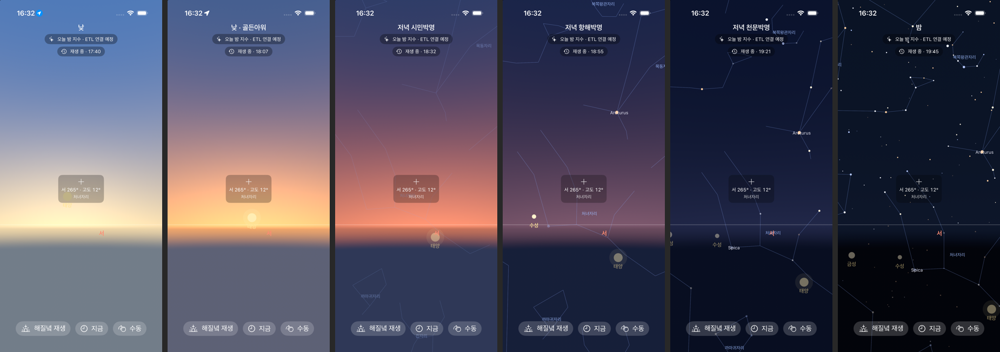

# M0-W2 진행 현황 (2026-09-29)

## 완료

| 항목 | 결과 | 근거 |
|---|---|---|
| Step 2a: iOS 스카이뷰 MVP | 시뮬레이터(iPhone 17, iOS 26.5)에서 빌드·실행 성공(Swift 6 strict concurrency complete) | 커밋 `056defb` |
| Step 2b: 백엔드 골격 | Boot 4.1.1 + Batch JDBC + Flyway + QueryDSL 7.7. BackendSmokeTest 2개 통과(Testcontainers MySQL 8.4), CI 통과 | 커밋 `7dc599c` |
| 하늘 셰이더(SkyColor.metal) | Metal Toolchain 설치 뒤 셰이더 포함 빌드 성공. 해질녘 재생에서 하늘색이 이어지는 것을 확인 | 아래 스크린샷 |

## 해질녘 재생 검증 (서울, 2026-09-29, 서쪽 265°·고도 12° 방향, `-playSunset`)

| 재생 시점 | 시뮬레이션 시각 | HUD 단계 | 관찰 |
|---|---|---|---|
| 1.5 s | 17:40 | 낮 | 파란 하늘, 회색 지면, 별·선 없음 |
| 7 s | 18:07 | 낮 · 골든아워 | 태양 쪽 지평선에 노란 글로우 |
| 12 s | 18:32 | 저녁 시민박명 | 분홍·주황 노을과 보라 하늘, 별자리 선이 켜지기 시작 |
| 15.5 s | 18:55 | 저녁 항해박명 | 짙은 남색 하늘, Arcturus(0등)와 수성이 나타남 |
| 18 s | 19:21 | 저녁 천문박명 | 별이 늘어남 |
| 21 s | 19:45 | 밤 | 천문박명 종료에서 자동 정지, 별 전체 표시 |

- 레티클 방위·고도와 별자리 판정: 16:22에 남 180°·고도 25° → 전갈자리(적경 약 17h, 적위 약 −27°로 천문학적으로 맞음)
- 낮에는 한계등급이 −5라서 별 0개(W2 합격 기준 ①)

## 남은 W2 항목(사용자 조치 필요)

| 항목 | 필요 조치 |
|---|---|
| G3 스모크, T-P1·T-P5 실기기 | Xcode에 개발자 계정 로그인 → `ios/project.yml`의 `DEVELOPMENT_TEAM` 설정 → iPhone에 설치 |
| `forecastIngestJob`·`astroDailyJob` 로컬 1회 성공 | data.go.kr 활용신청 3건 승인 뒤 인증키 전달(키는 `.env`/SSM에만 저장하고 커밋하지 않음) |
| 성능 G5(M0 한시 16.7 ms) | 실기기에서 측정(시뮬레이터 GPU 수치는 의미 없음) |
